# git-learn

## Git Commits

A commit in a git repository records a snapshot of all the files in your directory.

Git wants to keep commits as lightweight as possible though, so it doesn't just blindly copy the entire directory every time you commit. It can (when possible) compress a commit as a set of changes, or a "delta", from one version of the repository to the next.

Add new commit:

`git commit`

## Git Branches

Branches in Git are incredibly lightweight as well. They are simply pointers to a specific commit -- nothing more.

Because there is no storage / memory overhead with making many branches, it's easier to logically divide up your work than have big beefy branches.

Create new branch:

`git branch newImage`

`git commit`

Change branch:

`git checkout newImage`

## Branches and Merging

The first method to combine work that we will examine is `git merge`. Merging in Git creates a special commit that has two unique parents. A commit with two parents essentially means "I want to include all the work from this parent over here and this one over here, and the set of all their parents."

`git merge bugFix`

## Git Rebase

The second way of combining work between branches is rebasing. Rebasing essentially takes a set of commits, "copies" them, and plops them down somewhere else.

`git rebase master`

## HEAD

First we have to talk about "HEAD". HEAD is the symbolic name for the currently checked out commit -- it's essentially what commit you're working on top of.

HEAD always points to the most recent commit which is reflected in the working tree. Most git commands which make changes to the working tree will start by changing HEAD.

Normally HEAD points to a branch name (like bugFix). When you commit, the status of bugFix is altered and this change is visible through HEAD.

### Detaching HEAD

Detaching HEAD just means attaching it to a commit instead of a branch. This is what it looks like beforehand:

HEAD -> master -> C1

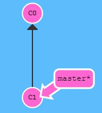

`git checkout C1`

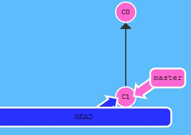

## Relative Refs

Moving around in Git by specifying commit hashes can get a bit tedious. In the real world you won't have a nice commit tree visualization next to your terminal, so you'll have to use `git log` to see hashes.

Furthermore, hashes are usually a lot longer in the real Git world as well. For instance, the hash of the commit that introduced the previous level is `fed2da64c0efc5293610bdd892f82a58e8cbc5d8`.

The upside is that Git is smart about hashes. It only requires you to specify enough characters of the hash until it uniquely identifies the commit. So I can type `fed2` instead of the long string above.

Specifying commits by their hash isn't the most convenient thing ever, which is why Git has relative refs.

Relative commits are powerful, but we will introduce two simple ones here:

* Moving upwards one commit at a time with `^`

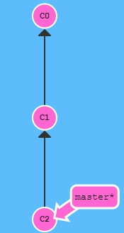

`git checkout master^`

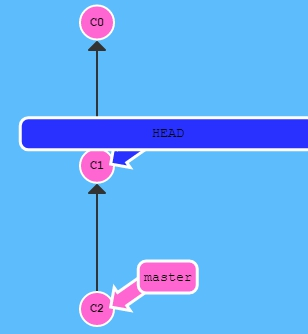

* Moving upwards a number of times with `~<num>`

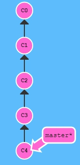

`git checkout HEAD~4`

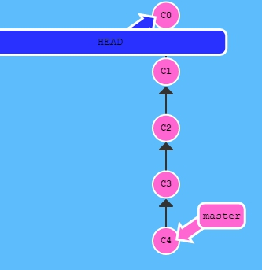

You can directly reassign a branch to a commit with the `-f` option. So something like:

`git branch -f master HEAD~3`

moves (by force) the master branch to three parents behind HEAD.

## Reversing Changes in Git

There are many ways to reverse changes in Git. And just like committing, reversing changes in Git has both a low-level component (staging individual files or chunks) and a high-level component (how the changes are actually reversed).

There are two primary ways to undo changes in Git -- one is using `git reset` and the other is using `git revert`. We will look at each of these in the next dialog

### Git reset

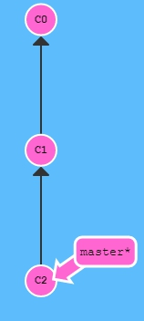

`git reset HEAD^`

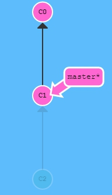

### Git revert

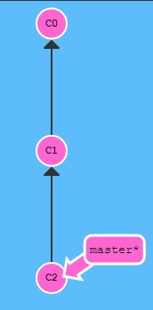

`git revert HEAD`

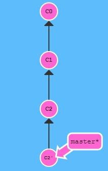

## Git Cherry-pick

`git cherry-pick <Commit1> <Commit2> <...>`

It's a very straightforward way of saying that you would like to copy a series of commits below your current location (HEAD).

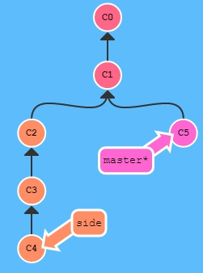

`git cherry-pick C2 C4`

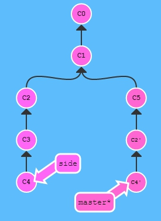

## Git Interactive Rebase

Git cherry-pick is great when you know which commits you want (and you know their corresponding hashes) -- it's hard to beat the simplicity it provides.

But what about the situation where you don't know what commits you want? Thankfully git has you covered there as well! We can use interactive rebasing for this -- it's the best way to review a series of commits you're about to rebase.

All interactive rebase means is using the `rebase` command with the `-i` option.

If you include this option, git will open up a UI to show you which commits are about to be copied below the target of the rebase. It also shows their commit hashes and messages, which is great for getting a bearing on what's what.

When the interactive rebase dialog opens, you have the ability to do 3 things:

* You can reorder commits simply by changing their order in the UI (in our window this means dragging and dropping with the mouse).

* You can choose to completely omit some commits. This is designated by pick -- toggling pick off means you want to drop the commit.

* Lastly, you can squash commits. Unfortunately our levels don't support this for a few logistical reasons, so I'll skip over the details of this. Long story short, though -- it allows you to combine commits.

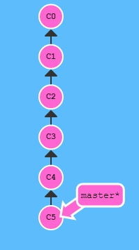

`git rebase -i HEAD~4`

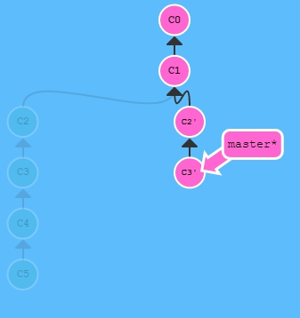

