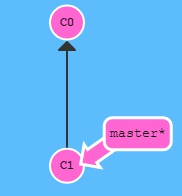
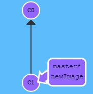
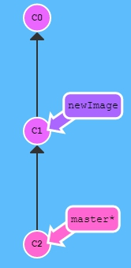
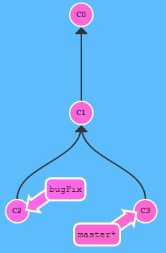
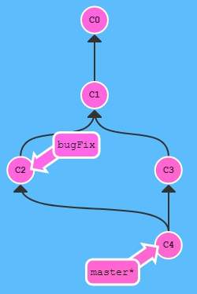
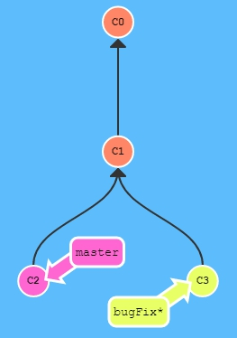
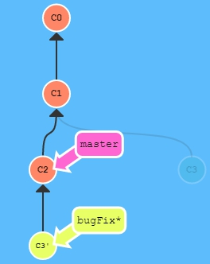

# git-learn

## Git Commits

A commit in a git repository records a snapshot of all the files in your directory.

Git wants to keep commits as lightweight as possible though, so it doesn't just blindly copy the entire directory every time you commit. It can (when possible) compress a commit as a set of changes, or a "delta", from one version of the repository to the next.

Add new commit:

`git commit`

## Git Branches

Branches in Git are incredibly lightweight as well. They are simply pointers to a specific commit -- nothing more.

Because there is no storage / memory overhead with making many branches, it's easier to logically divide up your work than have big beefy branches.

Create new branch:

`git branch newImage`

`git commit`

Change branch:

`git checkout newImage`

## Branches and Merging

The first method to combine work that we will examine is `git merge`. Merging in Git creates a special commit that has two unique parents. A commit with two parents essentially means "I want to include all the work from this parent over here and this one over here, and the set of all their parents."

`git merge bugFix`

## Git Rebase

The second way of combining work between branches is rebasing. Rebasing essentially takes a set of commits, "copies" them, and plops them down somewhere else.

`git rebase master`

